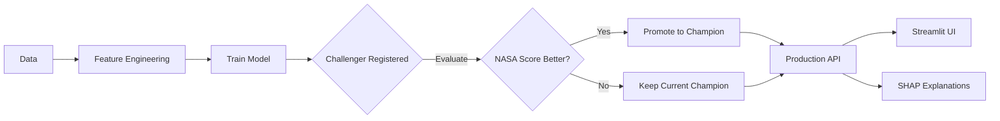

# Predictive Maintenance for Aircraft Engines (NASA CMAPSS)
### End-to-End MLOps Pipeline for Remaining Useful Life (RUL) Prediction


[](https://huggingface.co/spaces/ajazhussainsiddiqui/predictive-maintenance-cmapss)
[](https://jet-engine-rul.streamlit.app)


 **Production‑grade ML system** that predicts the **Remaining Useful Life (RUL)** of turbofan aircraft engines using NASA's CMAPSS dataset. Built with a MLOps stack featuring automated model versioning, model registry (champion/challenger), and real-time explainable AI.


> **Deployed**   
[**Streamlit Frontend**](https://jet-engine-rul.streamlit.app) | [**FastAPI on Hugging Face**](https://ajazhussainsiddiqui-predictive-maintenance-cmapss.hf.space) | [**API Docs**](https://ajazhussainsiddiqui-predictive-maintenance-cmapss.hf.space/docs)  

---


## Key Features

### **Machine Learning Pipeline**
- **Advanced Feature Engineering**: Rolling window statistics (5/10/30 cycles), lag features (1/3/5 steps), and rate-of-change calculations for time-series sensor data
- **Multi-Model Support**: LightGBM, XGBoost, Random Forest, and Ridge Regression with automated hyperparameter tuning via **Optuna** (50 trials)
- **Time-Aware Validation**: GroupKFold cross-validation ensuring no data leakage across engine units
- **Custom Metrics**: NASA asymmetric scoring function (penalizes late predictions more heavily)

### **MLOps & Infrastructure**
- **Experiment Tracking**: Full MLflow integration with parameterized runs, artifact logging, and metric comparison
- **Model Registry**: Champion/Challenger pattern with automated promotion based on NASA score performance
- **API Layer**: FastAPI backend with async file processing, batch prediction endpoints, and SHAP value computation
- **Interactive Frontend**: Streamlit dashboard for real-time predictions and model interpretation
- **SHAP Integration**: Force plots, waterfall charts, summary plots, and heatmaps for global and local feature importance
- **Model Interpretability**: Understanding why an engine is predicted to fail informs maintenance decisions

---

## Tech Stack

| Category | Technologies |
|----------|-------------|
| **Backend** | FastAPI, Pydantic, Uvicorn |
| **ML/DL** | LightGBM, XGBoost, Scikit-Learn, SHAP |
| **MLOps** | MLflow (Tracking + Registry), Optuna |
| **Frontend** | Streamlit, Plotly, Matplotlib |

---


## Performance Metrics / Result on test dataset
 
**Dataset: FD001** (Engine units with 1 failure mode, 1 operating condition)
| Model      | RMSE (all) | RMSE (last cycle) | NASA Score |
|------------|------------|-------------------|------------|
| Ridge regression      | 16.14       | 15.83              | 350.25     |
| XGBoost    | 15.64       | 15.05              | 343.86       |
| LightGBM   | 15.70       | 14.79              | **317.28**   |
---

**Dataset: FD002** (Engine units with 1 failure mode, 6 operating condition)  
| Model      | RMSE (all) | RMSE (last cycle) | NASA Score |
|------------|------------|-------------------|------------|
| Ridge regression | 18.45       | 17.18              | 1172.88     |
| XGBoost    | 17.64       | 15.63              | **986.37**       |
| LightGBM   | 17.79       | 16.14              | 1132.95   |  
---

**Dataset: FD003**  (Engine units with 2 failure mode, 1 operating condition) 
| Model      | RMSE (all) | RMSE (last cycle) | NASA Score |
|------------|------------|-------------------|------------|
| Ridge regression | 15.91       | 15.98             | 425.71   |
| XGBoost    | 12.29       | 14.23             | **325.57**    |
| LightGBM   | 12.01       | 14.39             | 335.36   |  
---

**Dataset: FD004**  (Engine units with 2 failure mode, 6 operating condition)  
| Model      | RMSE (all) | RMSE (last cycle) | NASA Score |
|------------|------------|-------------------|------------|
| Ridge regression | 18.57       | 20.14              | 1822.89  |
| XGBoost    | 15.72       | 17.04              | 1550.47  |
| LightGBM   | 15.93       | 17.30              | **1544.55**  |
---
*Lower NASA score is better – here late predictions are penalised more heavily than early.*


## Architecture


**Working Steps Diagram (Mermaid)**  




### Deployment infrastructure Stack
| Component | Platform | Purpose |
|-----------|----------|---------|
| **ML API** | Hugging Face Spaces | FastAPI backend with large CPU inference |
| **Frontend** | Streamlit Cloud | Interactive dashboard & SHAP visualizations |
| **Model Registry** | MLflow (SQLite) | Local tracking, portable to cloud |


## Why This Project Matters
**Business Context**: Unplanned aircraft engine failures cost airlines $50K-$100K per hour of downtime. 
This system enables **condition-based maintenance**, reducing unnecessary part replacements by predicting failures 30+ cycles in advance.

## System Architecture Highlights
- **Data Pipeline**: Handles 3 settings 21 sensors × 100 engines with automated feature drift detection
- **Latency**: <200ms prediction latency via FastAPI async endpoints
- **Explainability**: SHAP values provide maintenance engineers with failure root-cause analysis

## Exploratory Data Analysis & Prototyping

If you want to understand the mathematical and analytical decisions behind the pipeline, check out the notebooks:

* [**`01_eda.ipynb`**](./notebooks/01_eda.ipynb): Raw data inspection, sensor correlation analysis, and identifying low-variance features.
* [**`02_feature_engineering.ipynb`**](./notebooks/02_feature_engineering.ipynb): Logic for rolling window statistics, lag steps, and rate-of-change degradation capture.
* [**`03_modeling.ipynb`**](./notebooks/03_modeling.ipynb): Baseline Decision Tree training, metric definitions (NASA Asymmetric Score), and initial SHAP interpretability.


## Quick Start

### Prerequisites
```bash
Python 3.11  
Docker & Docker Compose (for API containerization)  
CUDA (optional, for GPU training)  
```
**Hardware:** CUDA-enable GPU used here (training uses `device: cuda`). For CPU-only remove `device: cuda` in `train.py` from XGBoost section.

### Installation & Local Setup

#### 1. Clone repository
```bash
git clone https://github.com/ajazhussainsiddiqui/cmapss-rul-mlops.git 
cd cmapss-rul-mlops

```

#### 2. Data Preparation

- Download the NASA CMAPSS Jet Engine Simulated Data (https://data.nasa.gov/dataset/cmapss-jet-engine-simulated-data) or 
  use it from data/raw/CMAPSS folder.
- Place the .txt files into data/raw/CMAPSSData/.

#### 3. Install dependencies
```bash
pip install -r requirements.txt
```


#### 4. Model Training Pipeline

```bash
# Generate features
python src/feature_engineering.py

# Train, tune, and register models
python src/train.py
```

### Configuration

Edit config.yaml to adjust all the paths and parameters :

```bash
data:
  dataset: "FD001"  # FD001, FD002, FD003, FD004
  
training:
  n_trials: 50    # Optuna hyperparameter search trials
  cv_folds: 5
...  

```
### Launch app
#### 1. Launch API Server

```bash
uvicorn app.main:app 
```
#### 2. Launch Streamlit Dashboard
```bash
cd frontend
streamlit run streamlit_app.py
```
or 

### Run API with Docker 
You can easily launch the FastAPI backend using Docker Compose, which automatically handles building the image and mounting the necessary model files

```bash
docker-compose up --build
```
The API will be available at `http://localhost:8000`.


### API Endpoints


| Endpoint |Method | Description |
|----------|-------|-------------|
| `/predict`| `POST` | Predict RUL from raw JSON sensor data. Returns DataFrame and optional SHAP values. |
| `/predict_from_uploaded_file` | `POST` | TXT/CSV file upload prediction |
| `/models` | `GET` | Lists all production-ready models currently available in the local models/ directory (all champoion models). |


> Note: Minimum 6 running cycles data required to generate rolling window and lag features.
